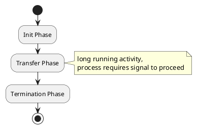
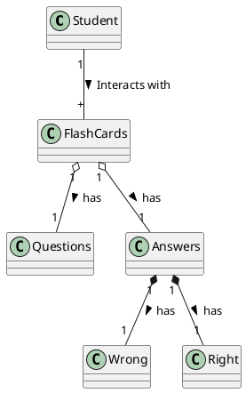
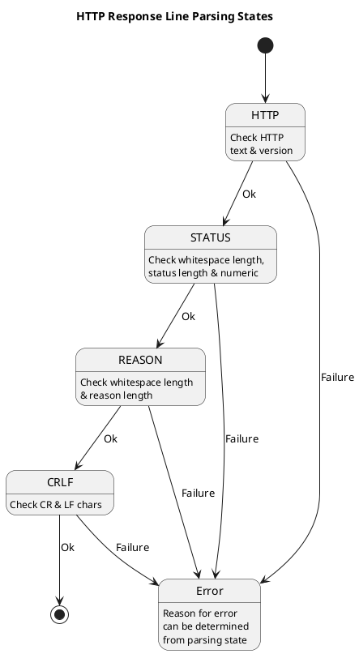
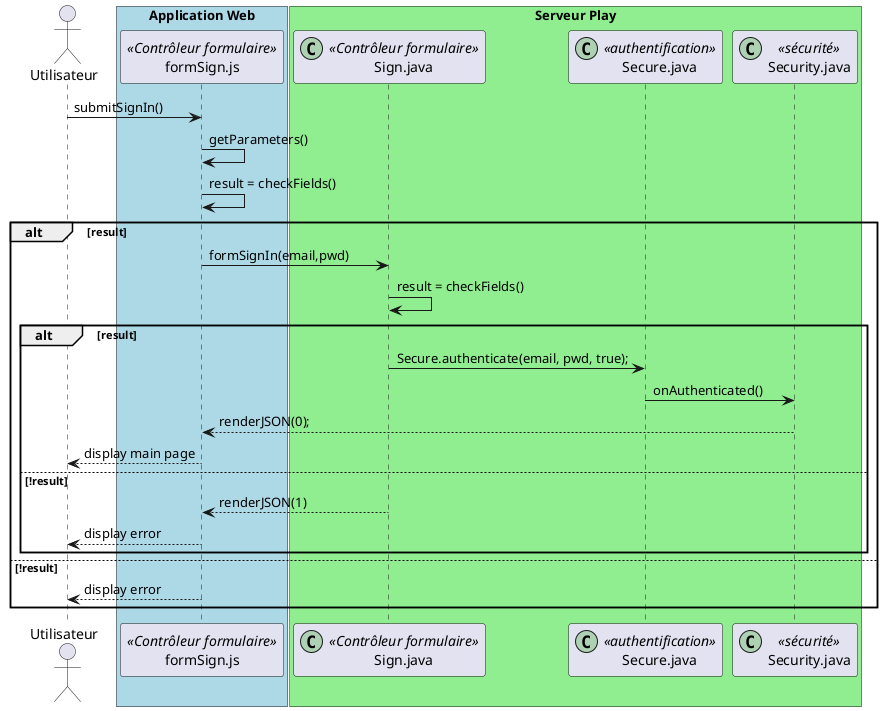
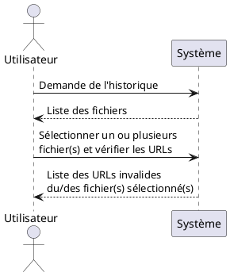
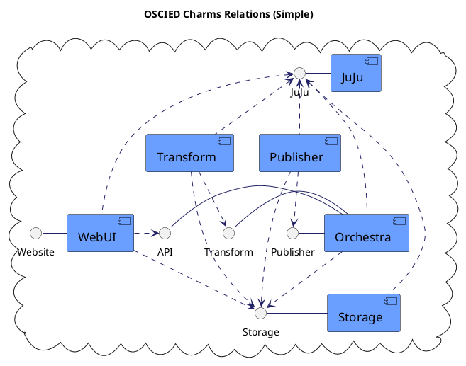

# plantUML-samples

```plantuml
@startuml
start
:Init Phase;
:Transfer Phase;
note right
  long running activity,
  process requires signal to proceed
end note
:Termination Phase;
stop
@enduml
```

```plantuml
@startuml

Class Student

Class FlashCards
Class Questions
Class Answers


Student"1" -- "+"FlashCards : Interacts with >

FlashCards"1" o-- "1"Questions : has >
FlashCards"1" o-- "1"Answers : has >
Answers"1" *-- "1"Wrong : has >
Answers"1" *-- "1"Right : has >


@enduml
```

```plantuml
@startuml

'Copyright (c) 2013-2015 Ken Barker

title HTTP Response Line Parsing States

[*] --> HTTP

HTTP : Check HTTP 
HTTP : text & version
HTTP --> STATUS : Ok
HTTP --> Error : Failure

STATUS : Check whitespace length,
STATUS : status length & numeric
STATUS --> REASON : Ok
STATUS --> Error : Failure

REASON : Check whitespace length
REASON : & reason length
REASON --> CRLF : Ok
REASON --> Error : Failure

CRLF : Check CR & LF chars
CRLF --> [*] : Ok
CRLF --> Error : Failure

Error : Reason for error
Error : can be determined
Error : from parsing state

@enduml
```

```plantuml
@startuml

actor Utilisateur as user
participant "formSign.js" as form <<Contrôleur formulaire>>
participant "Sign.java" as controler <<(C,#ADD1B2) Contrôleur formulaire>>
participant "Secure.java" as secure <<(C,#ADD1B2) authentification>>
participant "Security.java" as security <<(C,#ADD1B2) sécurité>>

box "Application Web" #LightBlue
	participant form
end box

box "Serveur Play" #LightGreen
	participant controler
	participant secure
	participant security
end box

user -> form : submitSignIn()
form -> form : getParameters()
form -> form : result = checkFields()

alt result

    form -> controler : formSignIn(email,pwd)
    controler -> controler : result = checkFields()
    
    alt result
    	controler -> secure : Secure.authenticate(email, pwd, true);
    	secure -> security : onAuthenticated()
    	security --> form : renderJSON(0);
    	form --> user : display main page
    else !result
    	controler --> form : renderJSON(1)
    	form --> user : display error
    end
    
else !result
	form --> user : display error
end

@enduml
```

```plantuml
@startuml

actor "Utilisateur"

"Utilisateur"-> Système: Demande de l'historique
"Utilisateur"<-- Système: Liste des fichiers
"Utilisateur"-> Système: Sélectionner un ou plusieurs\nfichier(s) et vérifier les URLs
"Utilisateur"<-- Système: Liste des URLs invalides\ndu/des fichier(s) sélectionné(s)

@enduml
```

```plantuml
@startuml

skinparam component {
    FontColor          black
    AttributeFontColor black
    FontSize           17
    AttributeFontSize  15
    AttributeFontname  Droid Sans Mono
    BackgroundColor    #6A9EFF
    BorderColor        black
    ArrowColor         #222266
}

title "OSCIED Charms Relations (Simple)"
skinparam componentStyle uml2

cloud {
    interface "JuJu" as juju
    interface "API" as api
    interface "Storage" as storage
    interface "Transform" as transform
    interface "Publisher" as publisher
    interface "Website" as website

    juju - [JuJu]

    website - [WebUI]
    [WebUI] .up.> juju
    [WebUI] .down.> storage
    [WebUI] .right.> api

    api - [Orchestra]
    transform - [Orchestra]
    publisher - [Orchestra]
    [Orchestra] .up.> juju
    [Orchestra] .down.> storage

    [Transform] .up.> juju
    [Transform] .down.> storage
    [Transform] ..> transform

    [Publisher] .up.> juju
    [Publisher] .down.> storage
    [Publisher] ..> publisher

    storage - [Storage]
    [Storage] .up.> juju
}

@enduml
```